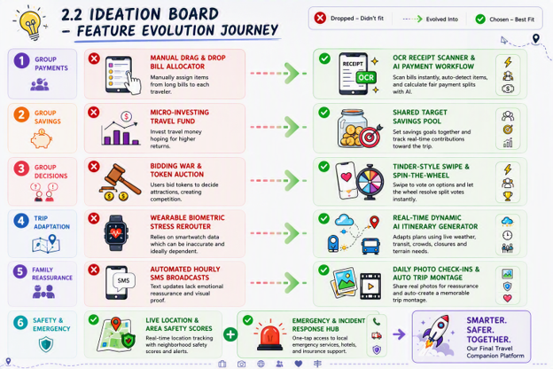
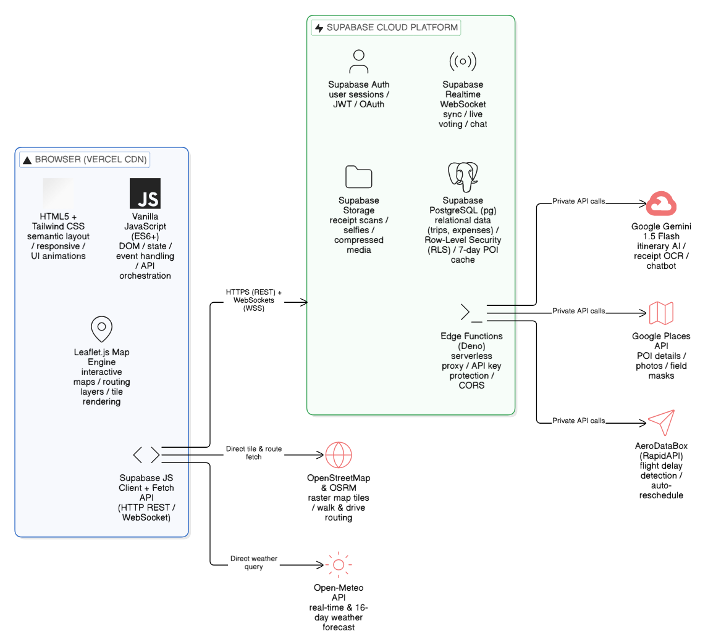

# Ryokō by Ctrl Y + B

**Team:** Tan Hock Lai, Yuen Ming Kit, Bryan Tiong You Pheng  
**Problem Statement:** Travel Planner  
**Video Presentation:** [Watch Video Presentation](https://youtu.be/q_wlVYhsmrU)

## 1. Project Overview

### 1.1 Problem Definition
Travel planning is plagued by structural inefficiencies, fragmented tool ecosystems, and real-time operational vulnerabilities. Research by Expedia Media Solutions shows that travelers visit an average of 38 different websites before booking. Furthermore, a Booking.com survey revealed that 44% of travelers struggle directly with aligning group budgets, preferences, and schedules like university semester breaks, often resulting in friction and compromise rather than seamless collaboration. Once on the ground, rigid itineraries fail to handle real-time disruptions, while safety communication remains an unresolved issue for families and solo travelers. These challenges break down into three critical operational bottlenecks:

* <strong>Fragmented Planning & Budget Blindness:</strong> Users are forced to context-switch across disconnected single-purpose tools for group chats, expense tracking, weather checks, and booking platforms. This disorganization obscures real-time total costs, making it difficult to set savings targets or evaluate overall trip affordability.
* <strong>Group Decision Paralysis:</strong> Aligning multi-member preferences, varying financial capabilities, and fixed schedules (e.g., university semester breaks) often results in friction, endless chat debates, and forced compromises rather than seamless group consensus.
* <strong>Static Execution & Safety Anxiety:</strong> Pre-trip itineraries cannot auto-adapt to unexpected live disruptions such as bad weather or sudden venue closures. Simultaneously, young travelers aged 18 to 25 lack experience handling unexpected situations in unfamiliar places, while female travelers face personal safety risks in high-risk environments. Both groups lack streamlined, proactive mechanisms for location-stamped family check-ins, local safety monitoring, or instant emergency SOS triggers during high-stress situations.

---

### 1.2 Key Stakeholders

#### Primary Stakeholders
* <strong>Group Organizers:</strong> Bear the heaviest burden balancing conflicting member schedules, gathering individual budgets, and managing on-the-ground trip logistics. Success requires automated coordination tools to eliminate single-person planning stress.
* <strong>Group Participants:</strong> Seek equal voting input, complete financial transparency, and low-effort onboarding. Clear visibility into shared savings targets and intuitive ways to contribute to group decisions remain essential.
* <strong>Solo Travelers:</strong> Depend entirely on self-sufficiency, requiring flexible planning alongside robust safety backups. Critical needs include real-time schedule adaptations when plans break down and immediate support during emergency situations.

#### Secondary Stakeholders
* <strong>Family & Emergency Contacts:</strong> Require automated transit updates, live location sharing, and daily photo check-ins from teenagers aging between 18-25 for the peace of mind. Consistent, low-effort reassurance ensures families stay informed about traveler safety and well-being without constant calls.

---

### 1.3 Existing Market Applications & Limitations

<strong>Table 1: Existing Apps & Market Shortcomings</strong>

<table>
  <thead>
    <tr>
      <th width="22%" align="left">App</th>
      <th width="38%" align="left">Market Positioning</th>
      <th width="40%" align="left">Key Limitations</th>
    </tr>
  </thead>
  <tbody>
    <tr>
      <td><strong>Sygic Travel</strong></td>
      <td>Collaborative itinerary planner focusing on day-by-day mapping and attraction time estimates.</td>
      <td>Functions as a static planner with no real-time AI adaptation for venue closures or transit delays. Lacks OCR receipt scanning, comprehensive budget tracking, and safety features like live area ratings or emergency shortcuts.</td>
    </tr>
    <tr>
      <td><strong>TripAdvisor</strong></td>
      <td>Crowd-sourced discovery and review engines for dining, accommodations, and local activities.</td>
      <td>Limited to isolated venue discovery and reviews rather than end-to-end trip execution. It cannot resolve group voting deadlocks, adapt to full schedules dynamically during weather/transit disruptions, or offer safety check-ins.</td>
    </tr>
    <tr>
      <td><strong>Wanderlog</strong></td>
      <td>Visual drag-and-drop itinerary builder with live collaborative editing and manual expense logging.</td>
      <td>Relies on manual canvas building rather than automated itinerary generation. It lacks pre-trip savings pool integration and provides no budget-accessibility matching for group travel.</td>
    </tr>
  </tbody>
</table>

---

### 1.4 Our Solution
Ryokō is an all-in-one trip planning platform that helps travelers plan, budget, decide, and adapt from initial inspiration to their final destination. Unlike single-purpose apps that address isolated pain points, Ryokō unifies automated group expense tracking, gamified decision-making, weather- and delay-aware AI itinerary generation, and integrated emergency check-ins into one seamless experience. By bridging logistics with safety and social features, Ryokō turns the chaos of group and solo travel into a collaborative, stress-free, and emotionally reassuring trip.

#### 1.4.1 Registration & User Profiling
* <strong>Personal Profile:</strong> Captures user demographics, dietary restrictions, travel styles, preferences, and emergency contacts.
* <strong>Group Setup:</strong> Enables group creation, member onboarding, and availability syncing. Ask for monthly availability dates as well as seasonal factors—such as monsoon periods or regional events—to suggest optimal travel timing and destinations.
* <strong>Solo Setup:</strong> Blindbox trip - optional feature where solo travellers can input their available time and budget so that the app could plan best match trip based on community trends and also online information.
* <strong>Community Feed:</strong> A public showcase where users share completed itineraries, budgets and attraction feedback, allowing others to browse for inspiration or clone plans directly.

#### 1.4.2 Budget & Savings System
* <strong>Trip Budget Estimator:</strong> Calculates predicted trip costs based on destination, duration, and travel style.
* <strong>Savings Pool:</strong> Sets monthly savings goals for individuals or group members and tracks real-time contributions toward a shared target.
* <strong>Receipt Scanner:</strong> OCR-powered scanner that parses physical or digital bills, auto-categorizes expenses, splits costs per person, and integrates an AI agent to assist with payment workflows.

#### 1.4.3 Group Decision Engine
* <strong>Attraction Upload:</strong> Allows members to submit custom locations or paste social media links or upload image of attractions into a shared pool alongside automated app recommendations.
* <strong>AI Recommendation Engine:</strong> Generates tailored activity suggestions based on aggregated group preferences and dietary needs.
* <strong>Tinder Style - Swipe Decision:</strong> A gamified, binary voting interface (swipe left to skip, swipe right to save) featuring a "Spin the Wheel" tie-breaker for split votes.

#### 1.4.4 AI Itinerary Generator
* <strong>Dynamic Delay Management:</strong> Monitors transit status via notifications to automatically reschedule downstream itinerary items when delays occur.
* <strong>Weather & Real-Time Adaptability:</strong> Integrates live weather feeds to dynamically swap outdoor activities for nearby indoor alternatives during inclement weather.
* <strong>Real-Time Closure Resolution:</strong> An instant AI assistant for venue disruptions. Upon encountering an unexpected closure on-site, the app generates curated nearby alternatives tailored to live location and user preferences.
* <strong>Peak Hour Optimization & Smart Packing:</strong> Recommends optimal visiting windows to bypass heavy crowds and auto-generates custom packing checklists based on destination terrain and weather forecasts.

#### 1.4.5 Safety & Emotional Value Features
* <strong>Daily Photo Check-Ins & Montage:</strong> Auto-creates safety groups with emergency contacts, enabling daily photo updates with location tags that reassure family members while compiling the media into a dynamic trip montage.
* <strong>Live Location & Area Safety Scores:</strong> Offers real-time, opt-in location tracking paired with neighborhood safety ratings to alert travelers to high-risk zones.
* <strong>Automated Transit Notifications:</strong> Monitors travel progress to automatically send real-time departure, delay, and arrival updates to emergency contacts.
* <strong>Emergency & Incident Response Hub:</strong> Triggers instant support via physical button shortcuts or quick menus—connecting users to local emergency contacts, hotel receptions for lost items, or automated travel insurance claim filing.

---

## 2. Ideation & Process

### 2.1 Ideas We Considered

<strong>Table 2: Ideation</strong>

<table>
  <thead>
    <tr>
      <th width="35%" align="left">Idea</th>
      <th width="65%" align="left">Why it was dropped / kept</th>
    </tr>
  </thead>
  <tbody>
    <tr>
      <td><strong>OCR Receipt Scanner & AI Payment Workflow (Chosen)</strong></td>
      <td><strong>KEPT.</strong> Eliminates post-meal money awkwardness by instantly doing the math for everyone, ensuring group bills are settled accurately and without delay.</td>
    </tr>
    <tr>
      <td><strong>Shared Target Savings Pool (Chosen)</strong></td>
      <td><strong>KEPT.</strong> Builds excitement and transparency around group trips, keeping everyone motivated and financially aligned.</td>
    </tr>
    <tr>
      <td><strong>Tinder-Style Swipe Decision & Spin-the-Wheel (Chosen)</strong></td>
      <td><strong>KEPT.</strong> Removes group decision fatigue and endless debate, making itinerary planning fast, fun, and completely fair when choices are split.</td>
    </tr>
    <tr>
      <td><strong>Real-Time Dynamic AI Itinerary Generator (Chosen)</strong></td>
      <td><strong>KEPT.</strong> Delivers a stress-free travel experience by automatically adapting to unexpected delays or bad weather, keeping your trip running smoothly without manual replanning.</td>
    </tr>
    <tr>
      <td><strong>Daily Photo Check-Ins & Auto Trip Montage (Chosen)</strong></td>
      <td><strong>KEPT.</strong> Gives loved ones at home total peace of mind while effortlessly preserving your favorite holiday memories into a recap video.</td>
    </tr>
    <tr>
      <td><strong>Live Location & Area Safety Scores (Chosen)</strong></td>
      <td><strong>KEPT.</strong> Empowers travelers to explore unfamiliar destinations with confidence, proactively steering you clear of potentially unsafe areas.</td>
    </tr>
    <tr>
      <td><strong>Emergency & Incident Response Hub (Chosen)</strong></td>
      <td><strong>KEPT.</strong> Guarantees immediate help and protection during critical moments.</td>
    </tr>
    <tr>
      <td><strong>Blind Box Trip</strong></td>
      <td><strong>KEPT.</strong> Provides an exciting and unique way for solo travelers to discover their next adventure, especially when they don't know where to go or what fits their time and budget.</td>
    </tr>
    <tr>
      <td><strong>Manual Drag & Drop Bill Allocator</strong></td>
      <td><strong>DROPPED.</strong> Severe screen clutter on mobile devices and tedious manual effort when assigning individual items on long bills.</td>
    </tr>
    <tr>
      <td><strong>Micro-Investing Travel Fund</strong></td>
      <td><strong>DROPPED.</strong> Complex financial regulatory hurdles and the risk of market downturns losing users' travel funds.</td>
    </tr>
    <tr>
      <td><strong>Bidding War & Token-Based Attraction Auction</strong></td>
      <td><strong>DROPPED.</strong> Created unnecessary competition within friend groups and favored users with more screen time to collect tokens.</td>
    </tr>
    <tr>
      <td><strong>Wearable Biometric Stress & Exhaustion Rerouter</strong></td>
      <td><strong>DROPPED.</strong> Smartwatch hardware dependencies and false triggers from simple excitement or walking.</td>
    </tr>
    <tr>
      <td><strong>Automated Hourly SMS Status Broadcasts</strong></td>
      <td><strong>DROPPED.</strong> Plain text messages lack emotional reassurance — family members wanted visual proof of safety rather than automated location texts.</td>
    </tr>
  </tbody>
</table>

---

### 2.2 Ideation Boards

  
  
<em>Figure 1: Feature Evolution Journey</em>

---

### 2.3 Mentor Consultation

<strong>Table 3: Mentorship Feedback & Feature Refinement Record</strong>

<table>
  <thead>
    <tr>
      <th width="10%" align="center">Date</th>
      <th width="18%" align="left">Mentor</th>
      <th width="36%" align="left">Feedback Received</th>
      <th width="36%" align="left">What Was Changed</th>
    </tr>
  </thead>
  <tbody>
    <tr>
      <td align="center"><strong>9/9/26</strong></td>
      <td><strong>Jarod Tan</strong></td>
      <td>
        • Focus more on the practical execution of the proposed features. 
        • Clarify how the required data will be obtained and processed during actual use. 
        • Consider suitable data sources, APIs, and technology stacks to support the proposed features. 
        • Ensure that the proposed features are technically feasible and implementable within the hackathon scope.
      </td>
      <td>
        • Shifted our development approach from focusing mainly on feature concepts to considering their actual implementation and feasibility. 
        • Researched and identified potential data sources and APIs required to support the application's core functions. 
        • Began mapping each proposed feature to the appropriate technology, API, and data-processing method. 
        • Refined the technical approach to ensure that the proposed features can be demonstrated realistically within the hackathon timeframe.
      </td>
    </tr>
    <tr>
      <td align="center"><strong>9/9/26</strong></td>
      <td><strong>Varsha Selvakumar</strong></td>
      <td>
        • Improve the expense-splitting experience by making it more flexible for different meals and individual spending. 
        • Strengthen the safety and emergency support provided to travelers, particularly for female travelers. 
        • Incorporate location-based safety information while ensuring that location tracking remains permission-based. 
        • Provide more proactive communication for flight status and travel disruptions.
      </td>
      <td>
        • Enhanced the expense management flow to allow meal-by-meal bill splitting, making it easier to identify each person's actual share. 
        • Added an opt-in location tracking system and incorporated safety information to help users make better decisions about their surroundings. 
        • Introduced a quick emergency trigger using the phone's quick shortcuts, allowing users to contact their designated emergency contacts more efficiently. 
        • Added automatic travel status notifications that can inform emergency contacts when a flight is delayed or has arrived.
      </td>
    </tr>
    <tr>
      <td align="center"><strong>9/9/26</strong></td>
      <td><strong>Kueh Pang Teng</strong></td>
      <td>
        • Add an AI chatbot agent to provide interactive assistance during trip planning and execution. 
        • Allow users to use social media links and content as references when planning attractions and itineraries. 
        • Introduce a tie-breaking mechanism for evenly split group decisions. 
        • Provide a quick way for users to share their location with emergency contacts when needed. 
        • Consider the different locations of group members when suggesting a convenient meeting point.
      </td>
      <td>
        • Added an AI chatbot agent to assist users with travel planning and travel-related queries. 
        • Enhanced attraction planning by allowing users to submit social media links as references for potential attractions and itinerary planning. 
        • Added a Spin the Wheel function to resolve 50/50 voting outcomes in the group decision process. 
        • Added a quick emergency location-sharing function that allows users to send their current location to designated emergency contacts. 
        • Added a meeting-point feature to help groups identify a convenient location for members to meet.
      </td>
    </tr>
    <tr>
      <td align="center"><strong>13/9/26</strong></td>
      <td><strong>Janelle Tan</strong></td>
      <td>
        • Make sure pitching is engaging. 
        • Explain why each feature is implemented in video. 
        • Keep the video flow understandable alongside the app demo. 
        • Improve the clarity for the budget saving pool
      </td>
      <td>
        • Structured the video flow into three parts — hook, app demo, and closure with impact — to make the pitch more engaging. 
        • Reframed each key feature to explain both the problem and the feature simultaneously, rather than explaning features alone. 
        • Implement dynamic explanations for key features alongside the app demo. 
        • Improved the savings pool clarity by showing the flow of money for each expense, so users can track contributions and spending more accurately.
      </td>
    </tr>
  </tbody>
</table>

---

## 3. Design & Prototype

**UI Prototype:** https://ryoko-travel-planner.vercel.app/
  
**[View screenshots and descriptions here](./Prtototype%20screenshots%20and%20description.pdf)**
---

## 4. What Makes It Different

<strong>Table 4: Feature Comparison Matrix</strong>

<table>
  <thead>
    <tr>
      <th width="20%" align="left">Feature</th>
      <th width="18%" align="left">Sygic Travel</th>
      <th width="18%" align="left">TripAdvisor</th>
      <th width="18%" align="left">Wanderlog</th>
      <th width="26%" align="left">Ryokō</th>
    </tr>
  </thead>
  <tbody>
    <tr>
      <td><strong>Real-Time AI Adaptation</strong></td>
      <td>Manual re-planning</td>
      <td>None</td>
      <td>Manual re-planning</td>
      <td><strong>Auto-routes on closure or weather disruption</strong></td>
    </tr>
    <tr>
      <td><strong>Emergency Safety Hub</strong></td>
      <td>None</td>
      <td>Static tips</td>
      <td>None</td>
      <td><strong>Hardware button shortcut & automated claims</strong></td>
    </tr>
    <tr>
      <td><strong>Reassurance & Check-ins</strong></td>
      <td>None</td>
      <td>None</td>
      <td>None</td>
      <td><strong>2-in-1 Daily photo check-in and auto montage</strong></td>
    </tr>
    <tr>
      <td><strong>Group Decision</strong></td>
      <td>List co-editing</td>
      <td>Forum discussions</td>
      <td>List co-editing</td>
      <td><strong>Gamified swipe voting + tie-breaker wheel</strong></td>
    </tr>
    <tr>
      <td><strong>Budget & Expense Tools</strong></td>
      <td>Basic cost estimates</td>
      <td>Price comparison only</td>
      <td>Manual expense logging & splitting</td>
      <td><strong>Shared Savings Pool & budget-accessibility matching</strong></td>
    </tr>
  </tbody>
</table>

 

* <strong>Real-Time Closure Resolution & Dynamic Adaptation:</strong> Existing tools require users to manually search for and rebuild schedules when an attraction is closed. Ryokō’s AI monitors live operational statuses and instantly suggests nearby replacements matching the group’s profile without breaking the day's itinerary flow.
* <strong>Hardware-Triggered Emergency & Incident Response Hub:</strong> Standard travel tools offer passive safety tips or static directories. Ryokō integrates rapid-access hardware and gesture shortcuts to trigger instant action during high-stress situations — silently alerting emergency contacts, sharing live GPS coordinates, or linking directly to hotel front desks and automated insurance claim workflows.
* <strong>Dual-Purpose Daily Safety Check-In & Automated Montage:</strong> While safety apps offer simple check-in pings, Ryokō merges peace of mind with travel memories: a daily photo submission serves simultaneously as a safety verification for family networks and an automated compiler for a dynamic trip memory montage.
* <strong>Gamified "Swipe & Spin" Decision Engine:</strong> Group trip voting usually lives in disorganized chat apps or manual polls. Ryokō adapts a Tinder-style binary swipe interface to aggregate multi-member preferences effortlessly, paired with a built-in "Spin the Wheel" tie-breaker for 50/50 split votes.
* <strong>Shared Savings Pool & Budget-Accessibility Matching:</strong> Existing apps only offer static price estimates. Ryokō ties travel planning directly to actual financial readiness: as the group deposits money into the Savings Pool, the app dynamically matches and unlocks itineraries, activities, and accommodations based on what the saved funds can afford.

---

## 5. Technical Architecture & Feasibility

### 5.1 Tech Stack

<strong>Table 5: Frontend</strong>

<table>
  <thead>
    <tr>
      <th width="25%" align="left">Technology</th>
      <th width="35%" align="left">Purpose</th>
      <th width="40%" align="left">Constraints</th>
    </tr>
  </thead>
  <tbody>
    <tr>
      <td><strong>HTML5</strong></td>
      <td>Page structure, semantic layout</td>
      <td>Universal browser support; no build step required</td>
    </tr>
    <tr>
      <td><strong>Tailwind CSS</strong></td>
      <td>Styling, responsive layout, UI animations</td>
      <td>CDN compiles at runtime, which can cause a flash of unstyled content — prevent it by setting <code>body {visibility: hidden}</code> inline in <code>&lt;head&gt;</code> and toggling to visible on <code>DOMContentLoaded</code></td>
    </tr>
    <tr>
      <td><strong>Vanilla JavaScript (ES6+)</strong></td>
      <td>DOM, app state, event handling, API and WebSocket orchestration</td>
      <td>Manual state management, but keeps the build zero-config and lightweight</td>
    </tr>
    <tr>
      <td><strong>Leaflet.js</strong></td>
      <td>Interactive mobile maps and routing layer</td>
      <td>Raster tiles require web access; to avoid blank gray tiles when unhiding containers, it calls <code>map.invalidateSize()</code></td>
    </tr>
  </tbody>
</table>

 

<strong>Table 6: Backend</strong>

<table>
  <thead>
    <tr>
      <th width="25%" align="left">Technology</th>
      <th width="35%" align="left">Purpose</th>
      <th width="40%" align="left">Constraints</th>
    </tr>
  </thead>
  <tbody>
    <tr>
      <td><strong>Supabase Auth</strong></td>
      <td>User authentication and sessions</td>
      <td>Disable email confirmation in the dashboard to bypass the 2-per-hour SMTP limit on free tier</td>
    </tr>
    <tr>
      <td><strong>Supabase Realtime</strong></td>
      <td>Multi-device sync for voting, chat, and budget updates</td>
      <td>200 concurrent connections; unsubscribe channel listeners on teardown to prevent leaks</td>
    </tr>
    <tr>
      <td><strong>Supabase Edge Functions</strong></td>
      <td>Server-side proxy for API keys (Places, AeroDataBox, Gemini)</td>
      <td>Deno runtime with ESM-only syntax; roughly 300ms cold start on idle</td>
    </tr>
    <tr>
      <td><strong>Supabase Storage</strong></td>
      <td>User-generated media such as receipt scans and profile photos</td>
      <td>1GB storage limit; compress images via client-side <code>&lt;canvas&gt;</code> before upload</td>
    </tr>
  </tbody>
</table>

 

<strong>Table 7: Database</strong>

<table>
  <thead>
    <tr>
      <th width="25%" align="left">Technology</th>
      <th width="35%" align="left">Purpose</th>
      <th width="40%" align="left">Constraints</th>
    </tr>
  </thead>
  <tbody>
    <tr>
      <td><strong>Supabase Postgres</strong></td>
      <td>Persistent relational data including trips, itineraries, votes, and expenses</td>
      <td>500MB storage on free tier; full SQL with foreign key and cascade delete support</td>
    </tr>
    <tr>
      <td><strong>Row-Level Security (RLS)</strong></td>
      <td>Scoped data protection per trip so members only access their own trip data</td>
      <td>Use permissive dev policies during build to avoid silent empty-array query returns that are hard to debug</td>
    </tr>
  </tbody>
</table>

 

<strong>Table 8: APIs and Services</strong>

<table>
  <thead>
    <tr>
      <th width="25%" align="left">APIs and Services</th>
      <th width="35%" align="left">Purpose</th>
      <th width="40%" align="left">Constraints</th>
    </tr>
  </thead>
  <tbody>
    <tr>
      <td><strong>Supabase Edge Functions</strong></td>
      <td>Server-side proxy for API keys, CORS-restricted requests, and link extraction</td>
      <td>500K invocations per month on free tier; Deno runtime with ESM-only syntax; roughly 300ms cold start on idle</td>
    </tr>
    <tr>
      <td><strong>Google Gemini 1.5 Flash</strong></td>
      <td>Itinerary generation, receipt OCR via multimodal vision, chatbot replies, and social link content parsing</td>
      <td>15 requests per minute and 1,500 per day on free tier; render visible loading skeletons for the 2–3 second processing time</td>
    </tr>
    <tr>
      <td><strong>Google Places API</strong></td>
      <td>POI details, photos, ratings, business hours, and coordinates</td>
      <td>Must route through an Edge Function to avoid browser CORS; apply strict Field Masks to conserve quota</td>
    </tr>
    <tr>
      <td><strong>AeroDataBox (RapidAPI)</strong></td>
      <td>Live flight tracking and schedule change detection for delay-triggered rescheduling</td>
      <td>400 units per month on free tier; pair with a manual delay trigger in the UI so the auto-reschedule flow can be demonstrated reliably during pitch day even if the tracked flight is on time</td>
    </tr>
    <tr>
      <td><strong>OpenStreetMap Tiles</strong></td>
      <td>Base map tiles for Leaflet</td>
      <td>Public volunteer servers with no SLA; apply tile caching where possible to reduce pop-in</td>
    </tr>
    <tr>
      <td><strong>Open-Meteo</strong></td>
      <td>Real-time and 16-day hourly weather forecasts</td>
      <td>Free for non-commercial use, no API key required, up to 10,000 calls per day</td>
    </tr>
    <tr>
      <td><strong>OSRM</strong></td>
      <td>Walking, driving, and cycling route coordinates between itinerary stops</td>
      <td>Public endpoint throttled at roughly 1 request per second; cache polyline arrays in Postgres to avoid HTTP 429 during demos</td>
    </tr>
  </tbody>
</table>

 

<strong>Table 9: Deployment</strong>

<table>
  <thead>
    <tr>
      <th width="25%" align="left">Technology</th>
      <th width="35%" align="left">Purpose</th>
      <th width="40%" align="left">Constraints</th>
    </tr>
  </thead>
  <tbody>
    <tr>
      <td><strong>Vercel</strong></td>
      <td>Frontend static delivery via global CDN with Git-based CI/CD</td>
      <td>100GB bandwidth per month and 100 deployments per day on free tier; zero build pipeline overhead for static files</td>
    </tr>
    <tr>
      <td><strong>Supabase Cloud</strong></td>
      <td>Managed Postgres, Auth, Realtime, Storage, and Edge compute</td>
      <td>Free instances pause after 7 days of inactivity; keep the project active through pitch week to avoid cold-start delays</td>
    </tr>
  </tbody>
</table>

---

### 5.2 System Architecture Diagram

  
  
<em>Figure 11: System Architecture Diagram</em>

---

### 5.3 Build Plan & Scope

<strong>Table 10: Implementation Roadmap</strong>

<table>
  <thead>
    <tr>
      <th width="18%" align="left">Task</th>
      <th width="15%" align="center">Timeline</th>
      <th width="27%" align="left">Primary Goal</th>
      <th width="40%" align="left">Key Actions</th>
    </tr>
  </thead>
  <tbody>
    <tr>
      <td><strong>Setup & Auth</strong></td>
      <td align="center">Sept 21 – 22</td>
      <td>Infra + Login working</td>
      <td>Supabase project · Schema · RLS · Auth UI · Vercel deploy · API keys</td>
    </tr>
    <tr>
      <td><strong>Trip + Group</strong></td>
      <td align="center">Sept 23 – 24</td>
      <td>Create trips + Invite via real code</td>
      <td>Trip UI · Unique invite code in DB · Join with validation · Realtime sync · Availability calendar</td>
    </tr>
    <tr>
      <td><strong>Decision Engine</strong></td>
      <td align="center">Sept 25 – 27</td>
      <td>Swipe voting with live consensus</td>
      <td>Swipe cards · Postgres write · Realtime broadcast · Spin wheel · Google Places photos</td>
    </tr>
    <tr>
      <td><strong>Savings Pool</strong></td>
      <td align="center">Sept 28 – 30</td>
      <td>Real budget tracking</td>
      <td>Savings UI · Contributions in Postgres · "Ready to Book" milestone · Storage upload</td>
    </tr>
    <tr>
      <td><strong>Receipt OCR + Split</strong></td>
      <td align="center">Oct 1</td>
      <td>Real OCR + Per-person split</td>
      <td>Gemini Vision · JSON parse · Meal ticker · Fair share calculation</td>
    </tr>
    <tr>
      <td><strong>AI Itinerary + Map</strong></td>
      <td align="center">Oct 2 – 4</td>
      <td>Real AI + Working map</td>
      <td>Gemini API · Structured days · Leaflet pins · OSRM routes · Open-Meteo weather</td>
    </tr>
    <tr>
      <td><strong>AI Rerouting</strong></td>
      <td align="center">Oct 5 – 6</td>
      <td>Real dynamic recovery</td>
      <td>Chatbot UI · Google Places radius search · Weather swap · Supabase update</td>
    </tr>
    <tr>
      <td><strong>Safety Hub</strong></td>
      <td align="center">Oct 7 – 8</td>
      <td>Guardian chat + SOS</td>
      <td>Real time chat · Selfie to storage · GPS · Safety score via Gemini · SOS</td>
    </tr>
    <tr>
      <td><strong>Polish & Deploy</strong></td>
      <td align="center">Oct 9 – 10</td>
      <td>Bug-free build</td>
      <td>Seed real data · Device testing · Final Vercel + Supabase deploy</td>
    </tr>
    <tr>
      <td><strong>Buffer</strong></td>
      <td align="center">Oct 11</td>
      <td>Submit</td>
      <td>Fix bugs · README · Submit</td>
    </tr>
  </tbody>
</table>

---

## 6. Impact

### 6.1 Before vs After

<strong>Table 11: Comparison of Current Practices and the Usage of Ryokō</strong>

<table>
  <thead>
    <tr>
      <th width="50%" align="left">Before Ryokō</th>
      <th width="50%" align="left">After Ryokō</th>
    </tr>
  </thead>
  <tbody>
    <tr>
      <td>38 websites and endless group chats</td>
      <td><strong>One shared workspace</strong></td>
    </tr>
    <tr>
      <td>Weeks of "where should we go?"</td>
      <td><strong>Swipe to decide in minutes</strong></td>
    </tr>
    <tr>
      <td>Guesswork budgeting</td>
      <td><strong>AI savings plan + shared pool</strong></td>
    </tr>
    <tr>
      <td>Unfair equal cost-splitting</td>
      <td><strong>Each pays only for what they ate</strong></td>
    </tr>
    <tr>
      <td>Plans collapse under rain or delays</td>
      <td><strong>AI replans instantly</strong></td>
    </tr>
    <tr>
      <td>Parents worry in silence</td>
      <td><strong>Parents are updated with daily check-ins</strong></td>
    </tr>
  </tbody>
</table>

---

### 6.2 Who Benefits

<strong>Table 12: Ryokō Impact Analysis</strong>

<table>
  <thead>
    <tr>
      <th width="28%" align="left">Target Users</th>
      <th width="72%" align="left">Impact</th>
    </tr>
  </thead>
  <tbody>
    <tr>
      <td><strong>University students</strong></td>
      <td>Plan trips in hours, save together, pay fairly, travel with less stress</td>
    </tr>
    <tr>
      <td><strong>Group organizers</strong></td>
      <td>No more chasing people — invites, voting, and contributions handled automatically</td>
    </tr>
    <tr>
      <td><strong>Solo travelers</strong></td>
      <td>Budget-matched itineraries, auto-replanning, full safety toolkit</td>
    </tr>
    <tr>
      <td><strong>Parents</strong></td>
      <td>Daily visibility via location-stamped selfies and arrival updates</td>
    </tr>
    <tr>
      <td><strong>Female travelers</strong></td>
      <td>Safety-Risk Scoring per attraction and quick SOS shortcut</td>
    </tr>
  </tbody>
</table>

---

### 6.3 Scalability

<strong>Table 13: Scalability and Growth Framework</strong>

<table>
  <thead>
    <tr>
      <th width="28%" align="left">Factor</th>
      <th width="72%" align="left">Detail</th>
    </tr>
  </thead>
  <tbody>
    <tr>
      <td><strong>Immediate audience</strong></td>
      <td>12 million university students across Southeast Asia</td>
    </tr>
    <tr>
      <td><strong>Broadening path</strong></td>
      <td>Solo travelers, young professionals, family trips, corporate retreats</td>
    </tr>
    <tr>
      <td><strong>Geographic reach</strong></td>
      <td>Works in any country — all APIs are global</td>
    </tr>
    <tr>
      <td><strong>Zero-cost growth</strong></td>
      <td>Every service has a paid tier ready — no rewrite needed</td>
    </tr>
    <tr>
      <td><strong>Community growth</strong></td>
      <td>Shared itineraries let one user's trip become another's starting point</td>
    </tr>
  </tbody>
</table>

---

## 7. Conclusion

Group travel is universal. The tools to plan it are broken — scattered across apps, blind to budgets, and silent on safety.

**Ryokō changes that.**

One app. One shared workspace — from the first idea to the last photo.

The problem is real. The users are waiting. The technology is ready.

  <h3>Plan Together • Go Together • Enjoy Together</h3>

